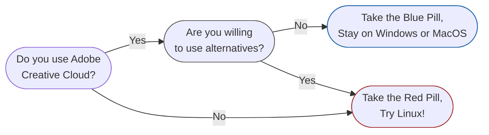

The biggest deciding factor of whether you will enjoy switching to [[Linux]] or not will be the software that you are reliant on in your everyday, and whether there are competent alternatives if it is not compatible with Linux.

---
# Adobe Suite
If you are invested, the [Adobe Creative Cloud Suite](https://www.adobe.com/creativecloud.html) is the biggest reason that will prevent you from fully migrating to Linux. Hopefully you are already tired of Adobe's absurd subscription pricing. See my tacky flow chart below for reasoning and a list of good alternatives.

### List of Adobe Software Alternatives

| Adobe                                  | Best Linux Alternative                                                                                                            | Alternative #2                                                                                               | Alternative #3                                                                                                                                                |
| -------------------------------------- | --------------------------------------------------------------------------------------------------------------------------------- | ------------------------------------------------------------------------------------------------------------ | ------------------------------------------------------------------------------------------------------------------------------------------------------------- |
| Premiere Pro                           | [[DaVinci Resolve]] Studio                                                                                                        | [Lightworks](https://lwks.com/) Create                                                                       | [Blender](https://www.blender.org/), [Kdenlive](https://kdenlive.org/)                                                                                        |
| Photoshop, Illustrator & InDesign      | Canva [[Affinity]] on Wine                                                                                                        | [Graphite](https://graphite.art/) & [Krita](https://krita.org/en/features/)                                  | [Gimp](https://www.gimp.org/), [Pinta](https://www.pinta-project.com/), [Inkscape](https://inkscape.org/), [Scribus](https://wiki.scribus.net/canvas/Scribus) |
| Lightroom                              | [DaVinci Resolve (Photo Tab)](https://www.blackmagicdesign.com/products/davinciresolve/photo)                                     | [Darktable](https://www.darktable.org/)                                                                      | [RapidRAW](https://www.getrapidraw.com/)                                                                                                                      |
| After Effects                          | DaVinci Resolve, Blender, [Nuke](https://www.foundry.com/products/nuke/nuke-indie) (or) [Natron](https://natrongithub.github.io/) | [[Cavalry]] on Wine                                                                                          | [Friction](https://friction.graphics/)                                                                                                                        |
| Substance Painter & Substance Designer | N/A - **[[Substance Painter Linux on Steam]]** and Enterprise subscriptions.                                                      | [Foundry Mari](https://www.foundry.com/products/mari) (or) [InstaMAT](https://instamaterial.com/?theme=dark) | [ArmorPaint](https://armorpaint.org/), [Material Maker](https://www.materialmaker.org/) or Blender                                                            |
A guy named KenneyNL has also created a helpful list of [Adobe-Alternatives](https://github.com/KenneyNL/Adobe-Alternatives) on his GitHub. 

---
# Paid vs Free/FOSS Software Alternatives
Some artists may be on a budget or looking to test linux out before committing money towards software. Here are some alternatives for beginners and professionals alike.

| Software (Linux Native - Proprietary)                                                                                             | Best Free or Open Source Alternative                                                                                                   |
| --------------------------------------------------------------------------------------------------------------------------------- | -------------------------------------------------------------------------------------------------------------------------------------- |
| SideFX Houdini                                                                                                                    | Blender (Geo Nodes)                                                                                                                    |
| Foundry Nuke                                                                                                                      | Natron (Native or Flatpak), Nuke Non-Commercial                                                                                        |
| Foundry Katana                                                                                                                    | [Gaffer](https://www.gafferhq.org/index.html)                                                                                          |
| DaVinci Resolve Studio                                                                                                            | DaVinci Resolve, Blender or Kdenlive                                                                                                   |
| [Autodesk RV](https://www.autodesk.com/products/flow-production-tracking/overview) (EXR Viewer)                                   | [DJV](https://github.com/grizzlypeak3d/DJV) or [OpenRV](https://github.com/AcademySoftwareFoundation/OpenRV)(Must compile from source) |
| [Maya](https://www.autodesk.com/campaigns/me-indie/maya-indie)/[3DsMax](https://www.autodesk.com/campaigns/me-indie/3dsmax-indie) | Blender                                                                                                                                |
| CInema 4D (No GUI - Terminal Only)                                                                                                | Blender, Houdini or Unreal Engine 5                                                                                                    |

---
# Free or Open Source Microsoft Office Alternatives

|                                                      | Alt #1                                                          | Alt #2                                    | Alt #3                             | Alt #4                                      | Alt #5                                                                                             |
| ---------------------------------------------------- | --------------------------------------------------------------- | ----------------------------------------- | ---------------------------------- | ------------------------------------------- | -------------------------------------------------------------------------------------------------- |
| MS Office 2024/Office 365                            | [FreeOffice](https://www.freeoffice.com/en/features/freeoffice) | [OnlyOffice](https://www.onlyoffice.com/) | [WPS Office](https://www.wps.com/) | [LibreOffice](https://www.libreoffice.org/) | [Free MS 365 Online](https://www.microsoft.com/en-us/microsoft-365/free-office-online-for-the-web) |
| [Visual Studio Code](https://code.visualstudio.com/) | [VSCodium](https://vscodium.com/)                               | VSCode                                    | -                                  | -                                           | -                                                                                                  |
| OneNote/Apple Notes                                  | [Obsidian](https://obsidian.md/)                                | -                                         | -                                  | -                                           | -                                                                                                  |

---
# Best Full Featured Screenwriting Alternatives

|             | Alt #1         | Alt #2                                                                            | Alt #3                                                                   | Alt #4                                                                                                             |
| ----------- | -------------- | --------------------------------------------------------------------------------- | ------------------------------------------------------------------------ | ------------------------------------------------------------------------------------------------------------------ |
| Final Draft | [[WriterSolo]] | [Obsidian w/ Fountain](https://www.obsidianstats.com/plugins/fountain-editor) | [Bamboo Fountain](https://ronin-on-linux.github.io/bamboo-fountain-web/) | [VSCodium w/ Better Fountain](https://marketplace.visualstudio.com/items?itemName=piersdeseilligny.betterfountain) |

---
# AirDrop Alternative

|                              |                                                         |
| ---------------------------- | ------------------------------------------------------- |
| AirDrop (Apple Devices Only) | [[LocalSend]] (Cross-platform; Linux, Windows, Mac/iOS) |

---
> [!info]
> There is a significantly larger number of alternatives, both paid, free or open source that are available that you can explore and discover on your own time. For this document, I did not include all of them to prevent it from becoming too cluttered or disorganized.

