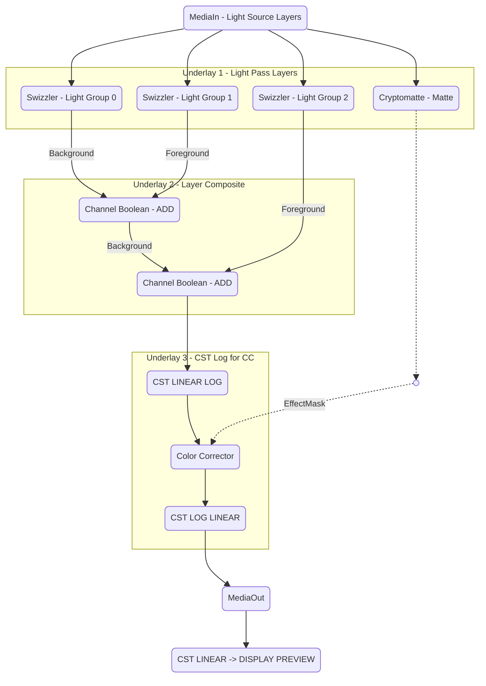
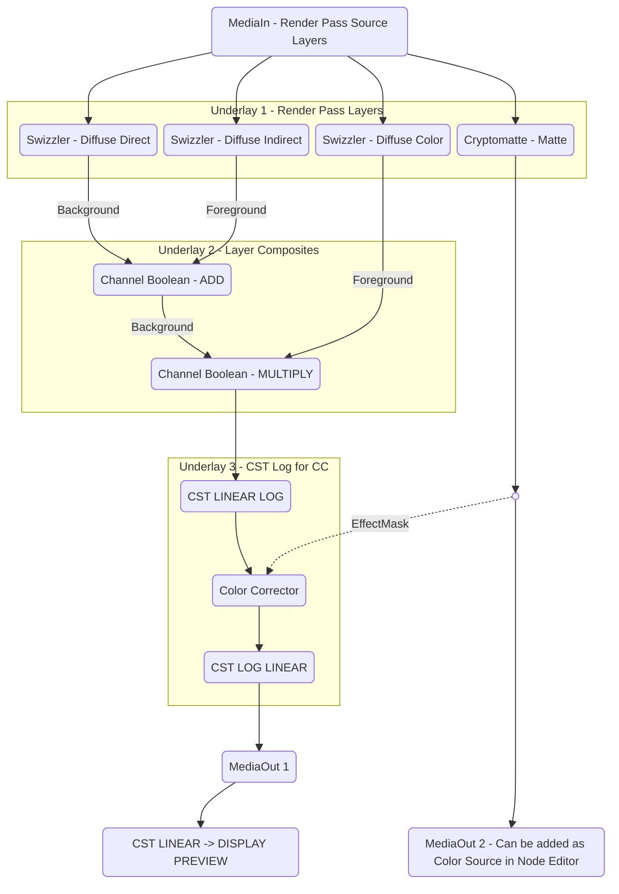
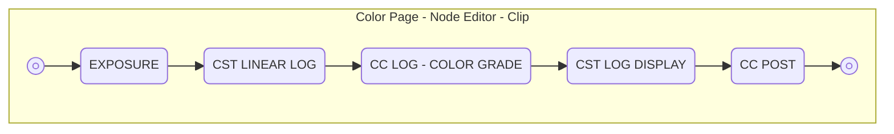

There are a plethora of ways to color grade in DaVinci Resolve and deciding which way to do it can be difficult. In my opinion there are a few workflows that I think matter to me, and matter in certain situations.
### My Top Two Color Workflows I am interested in are:
 1. **ACEScct/ACEScg Project Settings.** Industry Standard color workflow, with color space flowing properly between [[DaVinci Resolve]] Fusion and Color Page for best color grading.
	 1. Most useful for intensive VFX shots and client projects with heavy feedback.

 2. **DaVinci YRGB Project Settings.** Use individual OCIO or Color Space Transforms(CST) to grade each clip. This allows for easy mixing of EXR alongside Camera and Screen Recording footage with different tone mapping like AgX or DaVinci for each. (Great for YouTube and most Client projects). (Still compatible with fusion layer based workflow)

> [!info] Color Grading in Resolve
> Besides essential corrections like **Exposure**, **White Balance** and **Noise/Denoising**, the ***majority*** of your color corrections both in the Fusion and Color tab should be done in a ***logarithmic*** color space.

---
---
# DaVinci YRGB - Linear Rec709 Pipeline
This pipeline expects more than just EXR footage on your timeline. You will color manage each clip/layer individually in the fusion and color page.
### Project Color Management Settings
1. **File -> Project Settings -> Master Settings**
	1. Timeline Resolution -> Set desired resolution.
	2. Timeline Frame Rate -> *24 frames per second* (Or the appropriate framerate you used in your 3D rendering software.)

	![[ksnip_20260610-011104.png]]
2. **File -> Project Settings -> Image Scaling**
	1. Resize Filter -> Bilinear

	![[ksnip_20260610-011033.png]]
3. **File -> Project Settings -> Color Management**
	1. Color Science -> DaVinci YRGB
	2. Timeline Color Space -> Rec.709 Gamma 2.4
	3. Output Color Space -> Same as Timeline (or Specific Display Color Space)

	![[ksnip_20260610-011016.png]]
---
### Edit Page
1. Drag your Image Sequences into the Media Pool
2. Drag clips to timeline.
3. *(Studio version)* If clip resolution is smaller than the timeline resolution:
	1. Right click on clip in Timeline or Media Pool -> Clip Attributes -> Super Scale -> 2x (or 2x Enhanced) (Use sparingly. May affect color space in unpredictable ways.)
4. Make your edit.
5. **If OpenEXR -> Color tab.**
6. **If MultiLayer EXR or needs VFX -> Place Playhead Over your desired clip -> Fusion Tab**
---
### Fusion Compositing
Depending on the Type of layers you included in youe EXR, will determine exactly how you organize your setup, but generally you will use a few nodes more than others. 

To access and add nodes, press `Ctrl + Space` to  search for and add nodes.

|                                          |                                                                                                                                                           |
| ---------------------------------------- | --------------------------------------------------------------------------------------------------------------------------------------------------------- |
| **MediaIn/Loader**                       | MediaIn is the input from your Timeline Clip. Loader imports new media that is not on your Timeline from a file path.                                     |
| **MediaOut/Saver**                       | MediaOut is your your output back to the Edit and Color Pages. Saver exports/bakes media or frames to a file path.                                        |
| **Swizzler**                             | This is DaVinci Fusion's equivalent to the Nuke Shuffle node, used to break out individual layers found in your renders MultiLayer EXR.                   |
| **Cryptomatte**                          | This node is like the Swizzler, but specifically for Cryptomatte layers and ObjectID's that are used to create masks from objects or materials.           |
| **Channel Boolean**                      | This node is used to ADD or MULTIPLY your layers back into a composite image.                                                                             |
| **CST/OCIO/ACES Color Space Transforms** | These nodes, found in both the fusion and color tab are used to manage footage color space and gamut, whether linear, logrithmic or a final display look. |
| **Color Corrector**                      | This node is what you can use to make minor color adjustments to any node in fusion.                                                                      |
| **Underlay**                             | A useful container you can label to keep your node networks organized.                                                                                    |
> [!warning] Channel Boolean Alpha
> If you do not set the `to Alpha` to `Do Nothing` in your Channel Boolean, your Linear color space will not be preserved.

---
**See here a simple example of what a MultiLayer EXR with multiple Light Layers composited back together might look like, including applying a Cryptomatte mask on a Color Correction node in Logarithmic color space.**

![[ksnip_20260609-235524.png]]
> [!info] CST Display Preview Placement
> Notice there is a CST is AFTER the MediaOut so that you can PREVIEW what your final color space display transform will look like, but it leaves your original Linear color space untouched  headed through MediaOut and ready to color grade in the Color page.

---
**See here a simple example of what a MultiLayer EXR with multiple Render Passes composited back together would look like, including applying a Cryptomatte mask on a Color Correction node in Logarithmic.**

![[ksnip_20260609-235838.png]]
> [!iinfo] Use Fusion nodes in the Color Tab
> You can send more than one MediaOut to Color Page by connecting desired masks, mattes or layers to additional MediaOut nodes and then right clicking to add same number of additional sources in the Color Page.
> 
> In the above Example I have demonstrated connecting your Cryptomatte selection into MediaOut 2 to be used on Color page as a key or mask.
> 
> The number count will correlate with the placement of sources in the Color Tab.

---
### Color Grading on the Color Page
As noted above, color grades for any footage, rendered or live action, should be done in a logarithmic color space. Maintaining the correct order of operations will help you avoid breaking the image when pushing your color grade to its limits.

There are many powerful tools to achieve your vision but between the color section, the node editor and the effects panel, I’ll list the few that I think are essential for getting a quality grade, before you get all fancy.

In the color node editor, This is a simple layout of the proper sequence of nodes to create a proper color grade.

![[ksnip_20260609-234154.png]]

|                     |                                                                                                                                                                                                                                                                          |
| ------------------- | ------------------------------------------------------------------------------------------------------------------------------------------------------------------------------------------------------------------------------------------------------------------------ |
| **EXPOSURE**        | A Corrector node that you use to adjust the Gain or Gamma Exposure slider in the Primaries - Color Wheels                                                                                                                                                                |
| **CST LINEAR LOG**  | This is the node you use to convert your footage from LINEAR into a LOGARITHMIC working color space. Drag a Color Space Transform from the Effects Library onto this node. You can use the Color Space Transform, OCIO Color Transform or ACES Transform nodes to do so. |
| **CC LOG**          | Corrector node/nodes that you use to apply your color grade adjustments Should go here, in between the CST nodes as to keep your grade in the working logarithmic color space.                                                                                           |
| **CST LOG DISPLAY** | Drag a Color Space Transform from the Effects Library onto this node. This is the node you use to convert your footage from LINEAR into a LOGARITHMIC working color space. You can use the stock Color Space Transform, OCIO Color Transform or ACES Transform to do so. |
| **CC POST**         | Any minor adjustments after coloring or final effects that do not support a working color space like linear or log like sRGB/Rec709 overlays and effects.                                                                                                                |

| CST                                           | Raw/Log                   | Intermediate Logarithmic                  | Display                            |
| --------------------------------------------- | ------------------------- | ----------------------------------------- | ---------------------------------- |
| Color Space Transform for EXR                 | Rec.709 -Linear           | DaVinci Wide Gamut - DaVinci Intermediate | Rec.709 - Gamma 2.4 (or) Gamma 2.2 |
| Color Space Transform for Live Action Footage | Sony SGamut3.Cine - SLog3 | DaVinci Wide Gamut - DaVinci Intermediate | Rec.709 - Gamma 2.4 (or) Gamma 2.2 |
| OCIO Color Space (Blender Color Import)       | Rec.709 Linear            | AgX Log                                   | AgX Base sRGB                      |
| ACES 2.0                                      | ACEScg - CSC              | ACEScct - CSC                             | sRGB Gamma 2.2                     |
See [[Blender File Locations on Linux]] to locate your colormanagement folder and your Blender OCIO file. You can also download it to your home folder from the blender github to make it more accessible and easy to find.
> [!warning] Tone Mapping in Color Space Transform Node
> To get the proper image output when color grading your renders, you will need to make sure that Tone Mapping is DISABLED and OOTF is OFF in your CST Linear to Log node, and ENABLED in the CST Log to Display node, set to DaVinci and Apply Forward OOTF is ENABLED.
> 
> ![[ksnip_20260610-001835.png]]

> [!info] Group Color Grades
> If you want to grade/CST multiple clips at once, but maintain individual color grade adjustments on the clip level still, you can use Groups to do so. This gives you access to Group Pre-clip, Clip and Group Post-cip.
> 
> 1. Select multiple clips in the clips section, right click.
> 2. Add to new (or current) group.
> 3. At top of color nodes window, there is the drop down window that has the new Group Pre/Post-clip.
> 4. Exposure and CST Linear to Log should go in the Group Pre-clip.
> 5. Place any and all of your CC Log adjustments and color grades for individual clips in the normal Clip page
> 6. Your CST Log to Display and CC Post adjustments in the Group Post-clip.
> 7. Any additional clips you add to the group will inherit this grade.
> ```mermaid
> %%{init: {"themeVariables": {"fontSize": ".7rem"}}}%%
> %%{init: { 'flowchart': { 'nodeSpacing': 50, 'rankSpacing': 7.5, 'padding': 7.5 } } }%%
> graph TD
> A(EXPOSURE)
> B(CST LINEAR LOG)
> C(CC LOG - LOCAL COLOR GRADE)
> D(CST LOG DISPLAY)
> E(CC POST)
> F((( )))
> G((( )))
> H((( )))
> I((( )))
> J((( )))
> K((( )))
> subgraph Group1 [Color Page - Node Editor]
> 	subgraph Group2 [Group Pre-clip]
> 		direction LR
> 			F --> A --> B --> H
> 	end
> Group2 -.-> Group3
> 	subgraph Group3 [Clip]
> 		direction LR
> 			I --> C --> J
> 	end
> Group3 -.-> Group4
> 	subgraph Group4 [Group Post-clip]
> 		direction LR
> 			K --> D --> E --> G
> 	end
> end
> ```

![[ksnip_20260610-000925.png]]
### Export Rec709
The three most common formats I export most commonly are:
 
| Format      | Color Space/Gamma                                                              | Notes                                                                                                                                                                                               |
| ----------- | ------------------------------------------------------------------------------ | --------------------------------------------------------------------------------------------------------------------------------------------------------------------------------------------------- |
| ProRes 4444 | Rec.709 Linear or Color/Gamma of source footage (sLog 3, Red Log3, BRaw, etc). | Footage, Compositing and VFX baked into an editing format for easier transfer to client-side editors and colorists who will do the color grading and editing.                                       |
| EXR         | Rec.709 Linear or ACEScg                                                       | Compositing and VFX baked into an EXR image sequence for other client-side artists or team members to work with further. **(MultiLayer EXR Exports must be done via Saver Node in the Fusion tab)** |
| H.264/H.265 | Rec.709 Gamma 2.4                                                              | Final Deliverable for user playback on most monitors.                                                                                                                                               |
**Color Space is set at the project level, but to be safe for final deliverables set it on export under Advanced Settings.**
1. Render Settings -> Advanced Settings -> Color Space Tag -> **Rec.709**
2. Render Settings -> Advanced Settings -> Color Space Tag -> **Gamma 2.4** or any specific gamma of target viewing monitor.

| ProRes 4444 Export Linear PCM Audio | H.264 Export w/ Linear PCM Audio |
| ----------------------------------- | -------------------------------- |
| ![[ksnip_20260610-004134.png]]      | ![[ksnip_20260610-004306.png]]   |

---
---
# ACES 2.0 ACEScg DaVinci Pipeline
This pipeline is mainly for editing LINEAR/ACEScg VFX and EXR footage. You will color manage the entire project from the settings page and then adjust each clips grade individually in the color page.

> [!warning] Incomplete ACES Notes
> Jonas Noell has an excellent video on how to work with EXR footage in DaVinci Resolve in ACES color spaces. Although there are some things that I would change in his workflow as shown below in the fusion section using swizzler nodes, its an excellent resource. https://www.youtube.com/watch?v=qUbel17Jvcs
### Project Color Management Settings
1. **File -> Project Settings -> Master Settings**
	1. Timeline Resolution -> Set desired resolution.
	2. Timeline Frame Rate -> *24 frames per second* (Or the appropriate framerate you used in your 3D rendering software.)
2. **File -> Project Settings -> Image Scaling**
	1. Resize Filter -> Bilinear
3. **File -> Project Settings -> Color Management**
	1. Color Science -> ACEScct
	2. Timeline Color Space -> Rec.709 Gamma 2.4
	3. Output Color Space -> Same as Timeline (or Specific Display Color Space)
### Edit Page
1. Drag your Image Sequences into the Media Pool
2. Drag clips to timeline.
3. *(Studio version)* If clip resolution is smaller than the timeline resolution:
	1. Right click on clip in Timeline or Media Pool -> Clip Attributes -> Super Scale -> 2x (or 2x Enhanced) (Use sparingly. May affect color space in unpredictable ways.)
4. Make your edit.
5. **If OpenEXR -> Color tab.**
6. **If MultiLayer EXR or needs VFX -> Place Playhead Over your desired clip -> Fusion Tab**
### Fusion Compositing
See the Fusion Compositing section in the DaVinci YRGB Section Above for basic Fusion compositing guide.
### Color Grading on the Color Page
TBD (Havent had time to finish typing up) - You can follow the other sections instructions to get a similar result. Just use ACES transform in the color tab and set your Blender working color space to ACEScg instead of OCIO or CST nodes.
### Export Rec709
See DaVinci YRGB Export Section Above

# Notes, References and Resources
*These are a series of invaluable videos, channels and courses that helped me accumulate the notes on this page.*
1. Blender to Resolve - Gleb Alexandrov - https://creativeshrimp.gumroad.com/l/blender-to-resolve
2. ACES - Jonas Noell - https://www.youtube.com/watch?v=qUbel17Jvcs
3. Blender VFX - Robin Squares - https://www.youtube.com/watch?v=qUbel17Jvcs
4. Blender RAW Workflow - CG Cookie - https://www.youtube.com/watch?v=hS7uaTquwWc
5. Color for Beginners - Declan Jenkinson - https://www.youtube.com/watch?v=_KImTKhy_mI