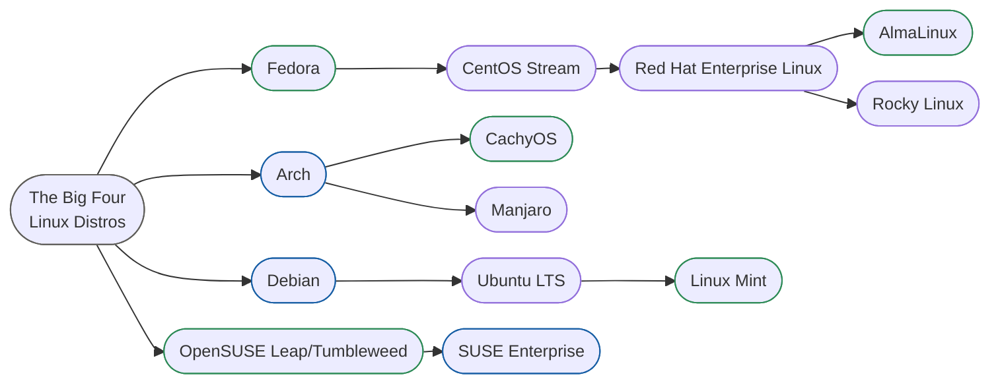

# Headline
I recommend 3D Artists try ***CachyOS with Cinnamon Desktop*** because its surprisingly stable for being Arch-based, its installer introduces you to the most important parts of Linux, lets you choose and customize what you need, and has multiple quality of life improvements and helpers that make it great to run software like Blender, DaVinci Resolve Studio and Affinity.

Cinnamon is a traditional, hassle free x11-based desktop environment that reduces the chances of software compatability issues.

---
# The Big Four Distros
***Debian, Fedora, Arch and SUSE*** are the top 4 Linux distributions I am aware of that have weathered the storms of open source over the last two decades or so since the early linux desktop innovations.

Most other distros you will see are derivatives or branches of these four projects.

There are endless reasons to try ANY [[Linux Distro]], and I recommend trying a few on your own. Exclusion of any distros from this graph is strictly for simplicities sake.

Linux distros marked in green are the ones that seem to be more popular amongst artists I have seen in discussions online in their respective linux families.

**Fedora** is focused on remaining 100% open source, maintaining software freedom, strongly community focused, shipping without any proprietary code. Unlike most rolling distros, its built around 6 month release schedule, and two releases are supported at a time to ensure maximum stability while also giving users access to the latest innovations. https://docs.fedoraproject.org/en-US/project/#_what_is_fedora_all_about

**Arch Linux** takes a simple, pragmatic, minimalist approach shipping with the absolute minimal base system. It seeks to provide access to the latest stable features and kernel. Development decisions are made based on evidence and consensus instead of ideaology. It sacrifices user-friendly features for ultimate respect for user-centric do-it-yourself ethos. It is very versatile but maybe more complex than other distribrutions. https://wiki.archlinux.org/title/Arch_Linux

**Debian** is hyperfocused on stability and software freedom, seeking to create a free and universal operating system, and is centralized around community based development governed by the projects constitution and code of conduct.  https://www.debian.org/intro/philosophy

**OpenSUSE** is focused on giving enterprise solutions that respect user choice, respect community feedback, and supply both a stable and rolling distro that fosters innovation in the upstream distro communities. They seek transparency and honesty in their development process and aim to make linux fun for users. https://en.opensuse.org/openSUSE:Guiding_principles

---
# The Building Blocks of a Linux Distribution
There are 6 essential components of a Linux operating system.

These elements can be mixed and matched, hence the reason there are so many Linux distros. Different developers and communities that prefer a certain ethos will draw from the source code of one of the big four, and combine it with different desktop environments and libraries to make it their own.
## 1. Linux Kernel
The foundation that allows the other components to communicate with one another for all linux distros.
1. https://www.kernel.org/linux.html
2. https://www.redhat.com/en/topics/linux/what-is-the-linux-kernel
## 2. Bootloader & Init System
Small programs that start the kernel and background services during boot. May be important to advanced power users, but new artists adopting Linux won't need to worry about this.
1. https://wiki.gentoo.org/wiki/Bootloader
## 3. System Libraries
*Packages glibc that help programs talk to the linux kernel. Generally, you will not need to worry to much about these at the system level.*
> [!info] DaVinci and System Libraries
> *System Libraries are relevant for DaVinci Resolve, because Fedora and most modern distro system libraries are newer than the ones DaVinci expects, so you have to remove the old glibc files that come with its installation to allow the new ones to populate.*
## 4. Display Server & Compositors
Most of what you need to know is that there are two display servers in Linux: X11/xserver and Wayland. *I 'd recommend you choose X11 for 3D work related tasks on Linux*. 

X11/Xserver is the longtime display server used in most distros for the last few decades. Hence most software in the VFX/3D industry has been developed for X11. Wayland is a newer, more secure server and compositor, but is not very compatible with some 3D and creative software packages.

Display servers are a package that bridges the gap between the desktop environment GUI and the other components that make up your distro. 

Compositors are a package that helps render graphical effects, transparency, and other animations for the desktop environment and server.
## 5. Desktop Environment/Window Managers
Unlike Windows and MacOS that ship with a single window manager and desktop environment, Linux developers have created a plethora of options that have become popular over the years. Picking a desktop environment that is based on x11 display server is generally better for 3D artists.
### The most popular desktop environments are: 
1. **Gnome (Wayland)** - *Image courtesy of https://gnome.org - cropped.*
	![[dark-gnome 2.webp]]
2. **KDE (Wayland/X11 temporarily)** - *Image courtesy of https://kde.org/announcements/megarelease/6/*
	![[kde_desktop.png]]
3. **Cinnamon (X11/experimental Wayland)** - *Image courtesy of https://fedoraproject.org/spins/cinnamon/*
	![[fedora-desktop-cinnamon.jpg]]
4. **XFCE (X11)** - *Image courtesy of https://www.xfce.org/about/screenshots*
	![[xfce_desktop.png]]
5. **Cosmic (Wayland)** - *Image courtesy of https://fedoraproject.org/spins/cosmic/*
	![[fedora-cosmic.jpg]]

### The most popular Linux window managers:
1. **Hyprland (Wayland)** - *Images courtesy of https://wiki.cachyos.org/installation/desktop_environments/ and https://learn.omacom.io/2/the-omarchy-manual/52/themes*
	![[hyprland-cachy-desktop.png]]
	
	![[omarchy-kanagawa 1.png]]
2. **Niri (Wayland)**
	![[niri-cachy-ywAwbqGB.jpg]]
3. **i3 (X11)/Sway (Wayland)** - *Image courtesy of https://i3wm.org/screenshots/*
	![[i3-14-desktop.png]]
	
	![[i3_cachyos_desktop.png]]
## 6. Drivers, Applications & Package Managers
Ensuring you have the proper NVIDIA and CUDA drivers installed makes sure all the features that your software will rely on can utilize your GPU.

Using Environment variables in your desktop files/app launchers can enhance or ensure that programs access to the GPU and Vulkan as needed. *(An Environment Variable is just a shell command added to the programs startup that tells it how to configure it and how it should behave.)*

---
# What's all this stuff about Red Hat, Fedora, & RHEL binary distros?
Red Hat Enterprise Linux is a paid product often used by governments and corporations to host web or media servers, comuting modules, etc on a very stable, super secure platform that doesn't need to be updated for a long period of time as to preserve the time wasted constantly upgrading software.

Fedora is the upstream project testing all the new features before they are implemented as a feature of Red Hat.

AlmaLinux and Rocky Linux are not Downstream from Red Hat, but instead what we call binary compatible. They take the source code of the Red Hat operating system since it is still open source, and repackage it in their own way, but they are binary compatible with anything that would run on Red Hat, hence the title of binary. Both Rocky and AlmaLinux are free and are often used in the place of the subscription based Red Hat in the vfx industry.

![[2023.updated.almafedoraRedhatoverview.webp]]