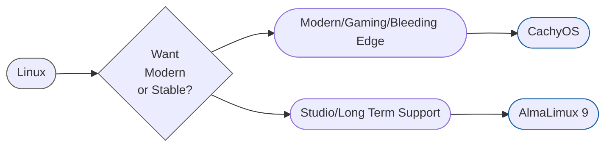

# Getting Started
> [!summary] My goal for this page is to unify all the Obsidian notes that I have created for [[Linux]] while setting up and troubleshooting my own creative workstation to hopefully reduce the friction it takes for 3D Artists, Video Editors and Photographers to get back into their creative flow.

>[!info] *Keep in mind these notes are based on my own experience, yours may vary.*
### Did You Know Linux is a VFX Industry Standard?
See the [VFX Reference Platform](https://vfxplatform.com/linux/) Surveys from [2021](https://drive.google.com/file/d/15b-4GMTSEE9tyqeQdBfy_LZnxQIdp38Y/view) and [2024](https://drive.google.com/file/d/1QWJS1PTvDGr6AliP4ejMzFTZ2WVEl0e-/view) to get a glimpse into the percentage of studios that use Linux, and what they are using.

---
### What Linux Distro Should You Start With?
There is an endless amount of good reasons to pick ANY of the many [[Linux Distros]], and I do recommend trying a few out on your own.

To make it easy for you, I say 3D Artists should try one of the two options below first.

| CachyOS ISO **Download Desktop Edition - Direct** | AlmaLinux 9 - KDE LIVE ISO Download **(Scroll Down to Live Media and Download KDE) (Don't Accidentally Download AlmaLinux 10)** |
| ------------------------------------------------- | ------------------------------------------------------------------------------------------------------------------------------- |
| https://cachyos.org/download/                     | https://almalinux.org/get-almalinux/#Live_Media-x86_64-9                                                                        |

---
# How to Install Linux?
See your corresponding guides for whichever one of the two distros you chose from above.
- **[[CachyOS - Guide for 3D Artists]]** - Likely better for most all around creators, gamers and users.
- **[[AlmaLinux 9 - Guide for 3D Artists]]** - Likely better for dedicated VFX artists and studio environments.

> [!info] Why these distros?
> If you want to see my reasoning for why I recommend these distros to 3D Artists over others, there is a quick summary under each index link above.
> 
> If you want to try something else out instead, [Linux Mint](https://linuxmint.com/), [Fedora](https://fedoraproject.org/workstation/) or [Ubuntu LTS](https://ubuntu.com/desktop) are great starting places. In fact, please do, but know there will be less documentation on this site to help you.

---
# What Software Works on Linux? Alternatives?
### Common Creative Software Native to Linux:

|                           |                         |                          |
| ------------------------- | ----------------------- | ------------------------ |
| Blender                   | DaVinci Resolve         | DaVinci Resolve Studio   |
| Houdini                   | Adobe Substance Painter | Adobe Substance Designer |
| Nuke & Mari               | Unreal Engine 5         | Unity                    |
| Affinity on Linux (Wine)  | Krita                   | Maya                     |
| DJV (EXR Sequence Viewer) | VS Code & VS Codium     | 3dsMax                   |
| OBS Studio                | Steam (Games)           | Gaffer                   |
| Slack, Discord, Matrix    | Obsidian                | Web Browsers             |
### See [[Linux Software Alternatives]] to view Alternatives if you do not see your software in the above list.

---
> [!abstract] Be Honest with Yourself
> Be very honest with yourself about your needs and interests. What software and workflow changes you are willing to make and what you are not willing to sacrifice to gain whatever attracts you to Linux?

>[!question] Why did I Make this Resource, and Why Linux?
>Near the end of 2025 a [[Windows]] update broke my installation during an important client project. After weeks of troubleshooting with no success, something needed to happen. I've always been a Linux enthusiast, so I decided it was time to try Linux in production.
>
>Switching to Linux always involves a bit of a learning curve. Whether you are here because you are just curious about Linux as a hobby or because you are serious about adopting it, my hope is this documentation can help you troubleshoot a range of issues that I ran into along the way, because very often the issues you encounter are just a matter of knowing.

> [!bug] Why is there NOT instructions for AMD GPU users?
> Because I do not own any AMD hardware, so it would be unfair for me to instruct users on how to use hardware that I haven't thoroughly tested my workflows myself - especially since AMD vs NVIDIA does change a few things on Linux/Open Source. I apologize and hope to be able to add the AMD instruction set to this documentation as soon as possible.

> [!info] How did I make this website?
> Maybe you want to host your own obsidian notes on github. I found Isak's video very helpful attached below! I also used the Quartz v5 documentation. https://quartz.jzhao.xyz/

<iframe width="800rem" height="485rem" src="https://www.youtube.com/embed/zGFroBGud7w" title="Turn Your Obsidian Notes Into A Website" frameborder="0" allow="accelerometer; autoplay; clipboard-write; encrypted-media; gyroscope; picture-in-picture; web-share" referrerpolicy="strict-origin-when-cross-origin" allowfullscreen></iframe>
